

# 📘 PRIMERA UNIDAD: Fundamentos de Algoritmos y Programas

---

## 📑 Temas de Aprendizaje

### 1. Algoritmos

Un *algoritmo* lo podemos definir como una serie de pasos o instrucciones de manera finita, con el propósito de solucionar una problemática o tarea en específico. 

  
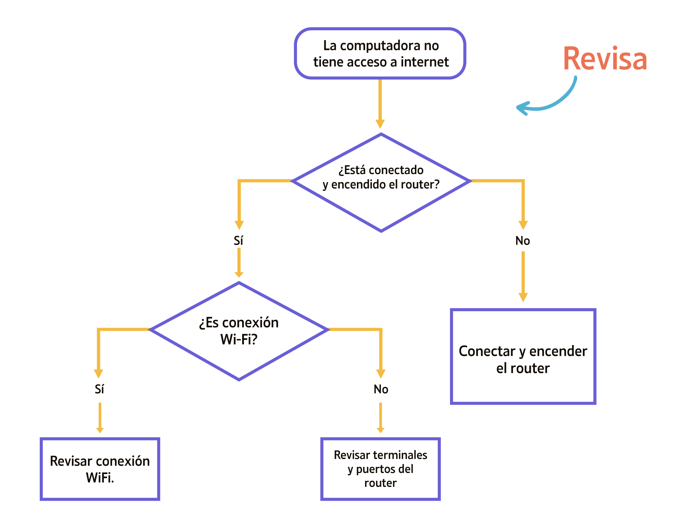

### 2. Pseudocódigos
*¿Qué es un psudocódigo?*

Una vez teniendo en cuenta el concepto sobre el algoritmo, a el pseudocódigo lo podemos definir como una manera de escritura de un algoritmo con una similitud muy cercana al lenguaje humano, pero manteniendo la estructura rígida de un lenguaje de programación. 

  
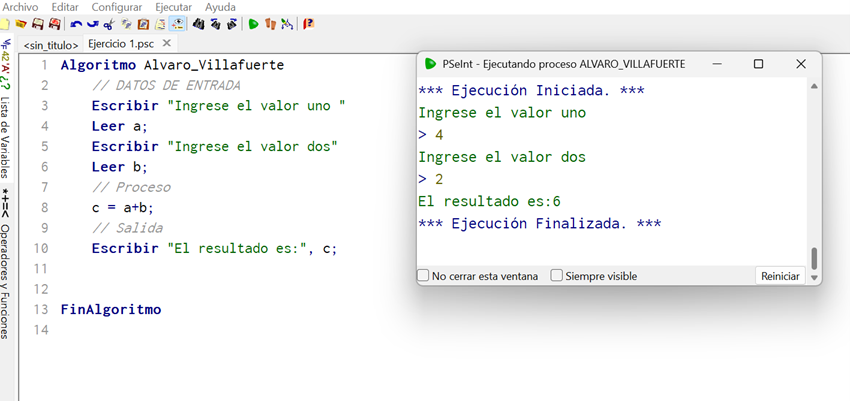

### 3. Diagrama de Flujo
Un diagrama de flujo no es mas que la representación gráfica de un algoritmo o proceso, que a diferencia del pseudocódigo que usa palabras predefinidas para definir el proceso, este utiliza símbolos geométricos conectados entre si por medio de flechas para mostrar visualmente la trayectoria del algoritmo, generando una manera más didáctica para el análisis de estos procesos.

  
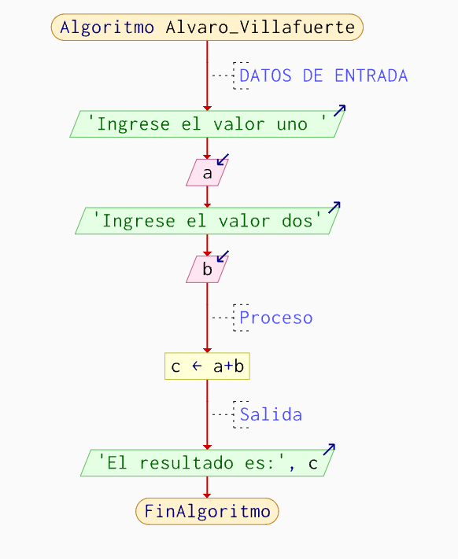

### 4. Prueba de Escritorio
Una prueba de escritorio es una técnica o prueba manual que se utiliza para la veracidad de la respuesta y proceso de ejecución de un algoritmo.

#### 📝 Ejemplo de Prueba de Escritorio
| Datos de Entrada | Proceso | Datos de Salida |
| :--- | :--- | :--- |
| Primer Número: 1 | Suma = 2 + 4 | 6 |

### 5. Lenguajes de Programación.
Un lenguaje de programación lo podemos definir como aquel conjunto de reglas, normas, simbolos, palabras predefinidas, que permiten a un programador escrbir de manera digital las instrucciones que desea que un ordenador las ejecute. O en otras palbras es aquel lenguaje que permite a nostros los seres humanos poder mantener una comunicación más comprensible y entendible con un ordenador, pues el lenguaje de estos es en binario (0,1) y seria muy complicado de interpretarlo.

  
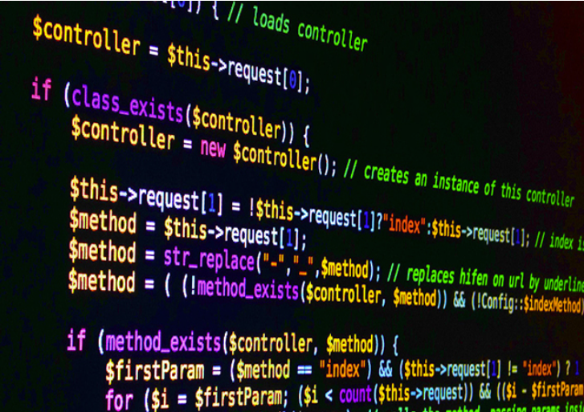

### 6. Programación por Bloques
Un diagrama de flujo no es mas que la representación gráfica de un algoritmo o proceso, que a diferencia del pseudocódigo que usa palabras predefinidas para definir el proceso, este utiliza símbolos geométricos conectados entre si por medio de flechas para mostrar visualmente la trayectoria del algoritmo, generando una manera más didáctica para el análisis de estos procesos.

  
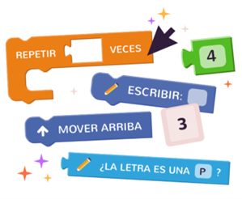

## 🧠EJERCICIO APLICATIVO DE LOS CONOCIMIENTOS🧠

## PLANTEAMIENTO DEL PROBLEMA 

Un empleador de la concesonaria de autos TOYOTA en Loja, posee un inconveniente, que nunca consigue el valor de las comisiones generadas por sus tres vendedores, la cual es del 4% sobre la venta de cada automovil, el desea un programa que le de esos valores de manera rapida y eficiente.

### ANALISIS DEL PROBLEMA 

El usuario posee una necesidad de saber cuales son los valores de comisión independientes para cada uno de sus vendedores.
Por lo tanto primero definimos las variables que necesitaremos para el problema.

  
| Variable | Uso |
| :--- | :--- | 
| precioCarro1 | Recibir y guardar valor del carro 1 |
| precioCarro2 | Recibir y guardar valor del carro 2 |
| precioCarro3 | Recibir y guardar valor del carro 3 |
| comision1 | Para guardar el valor calculado del 1er automovil |
| comision2 | Para guardar el valor calculado del 2do automovil |
| comision3 | Para guardar el valor calculado del 3er automovil |

Una vez teniendo en cuenta las variables para el proceso, procedemos a realizarlo en psenit para generar el algoritmo.

### DIAGRAMA DE FLUJO OBTENIDO ✅

  
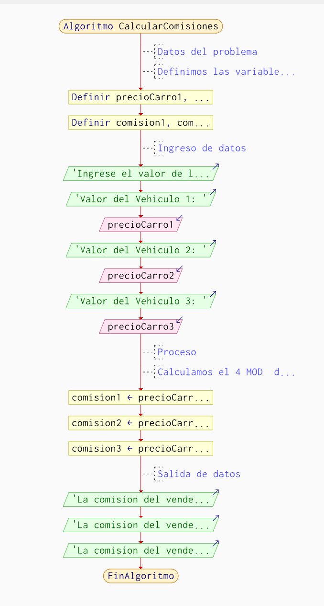

### PSEUDOCÓDIGO ESCRITO ✅
  
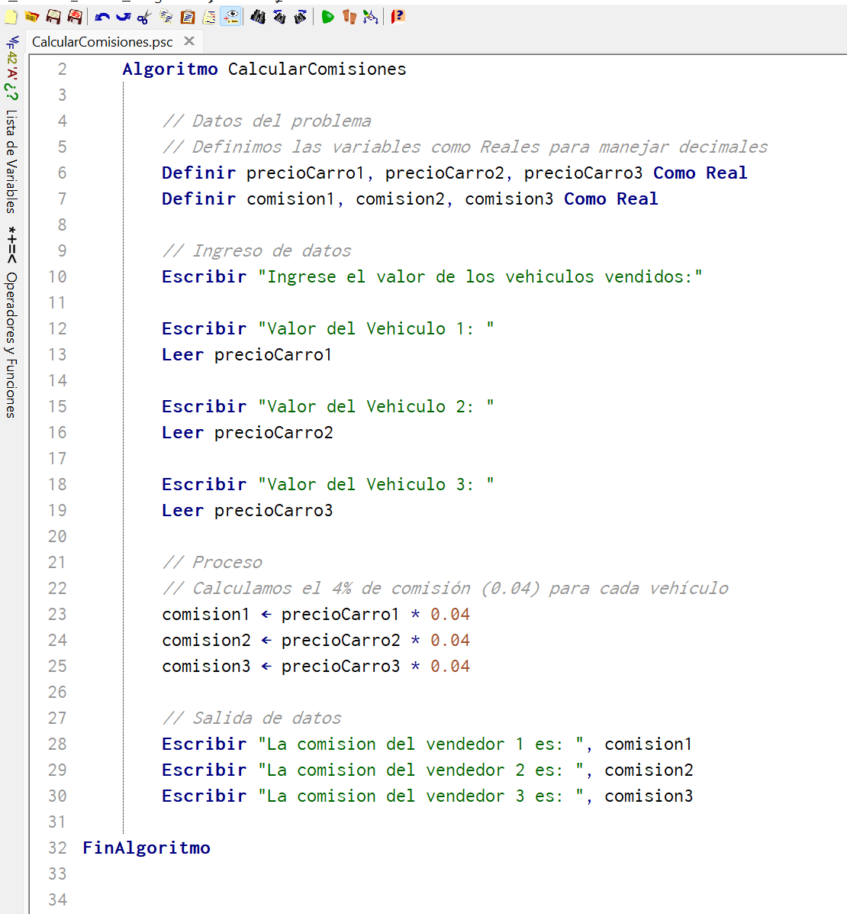

### VERIFICACION DEL PSEUDOCODIGO 📃

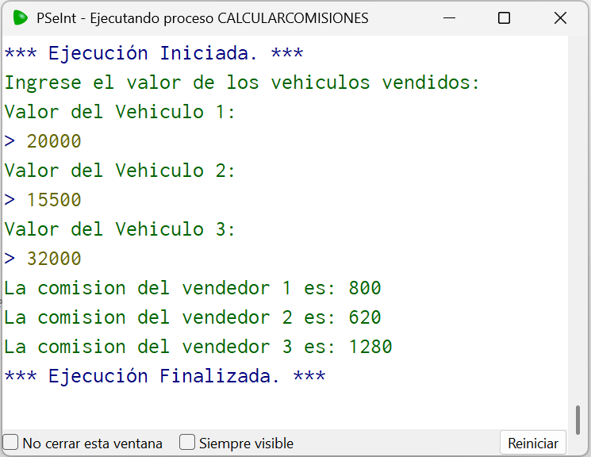

### ⚪ CODIFICACION EN LENGUAJE DE PROGRAMACION C ⚪
Una vez realizado el pseudocódigo y haberlo probado, podemos proceder a escribir el algoritmo en lenguaje de programación C, tomando como referencia el pseudocódigo con el fin de evitar errores. 

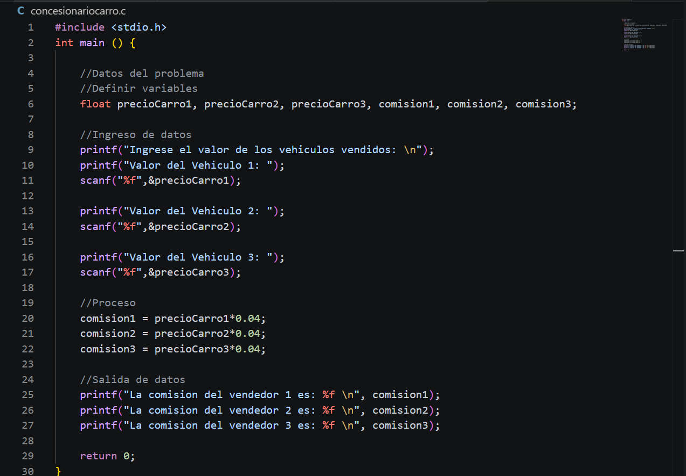

### 🟦 VERIFICACION EN LA TERMINAL DE VISUAL STUDIO CODE 🟦
Ya escrito el codigo fuente, copilamos con el comando *"gcc concesonariocarro.c -o consesonariocarro"*,  y posterior lo ejecutamos en la terminal con el comando *".\concesonariocarro.exe"*.

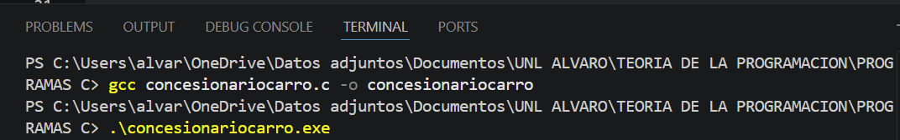

Una vez que nuestro lenguaje ha sido copialdo, lo ejecutamos en la terminal y verificamos si todo funciona correctamente.

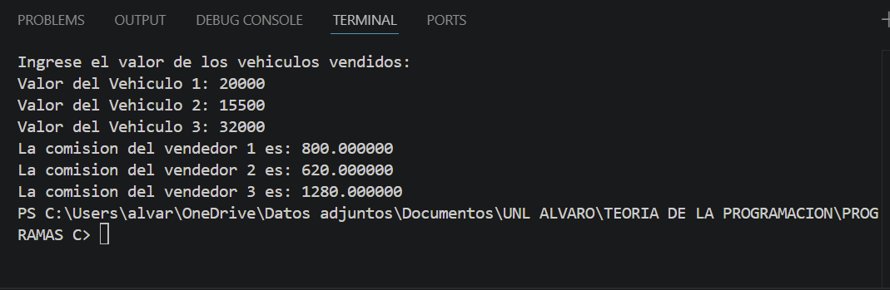

### ☑️PRUEBA DE ESCRITORIO☑️
Con el fin de ver la veracidad de los datos obtenidos por nuestro algoritmo en el programa, se procede a generar una prueba de escritorio.

| Datos de Entrada | Proceso | Datos de Salida |
| :--- | :--- | :--- |
| Precio Carro 1 = 20000 | 20000*0.4 | 800 |
| Precio Carro 2 = 15500 | 15500*0.4 | 620 |
| Precio Carro 3 = 32000 | 32000*0.4 | 1280 |

### CONCLUSIÓN
Se pudo dar resolución a la problemática del usuario por medio de la generación de este algorito y de igual manera se comprueba la vericidad de los datos generados por el algoritmo.

## 🟡REFLEXIÓN CRÍTICA 🟡

Con el cumplimiento de la primera unidad, podemos decir que el dearollo y estudio de algortimos han permitido desarollorar y mejorar el pensamiento computacional. Pues gracias a las herramientas como PSeInt, que aunque simples, permiten demostrar como es de importante una buena capacidad de estructurar soluciones por medio de pasos ordenados, he de aqui la vitalidad de enteder la problemática en su totalidad y no de manera parcial.
Una vez captado todo lo básico en la introducción en la programación, durante la transferencia a un lenguaje completo de programación, se pudo realizar con mayor facilidad gracias a las bases obtenidas anteriormente.
Para este punto es importante destacar que a comparación de PSeInt, donde usabamos palabras en nuestro lenguaje natal (Español) para la generación del algoritmo, en lenguajes de programación como lo es C, la cosa es diferente, pues se utilizan palabras predefinidas para generar una acción en especifica dentro de este programa, al igual que el uso de mascaras para poder realizar la lectura y escritura de variables durante la ejecución del mismo. 

[⬅️ VOLVER A CONTENIDOS](./CONTENIDOS.MD)

